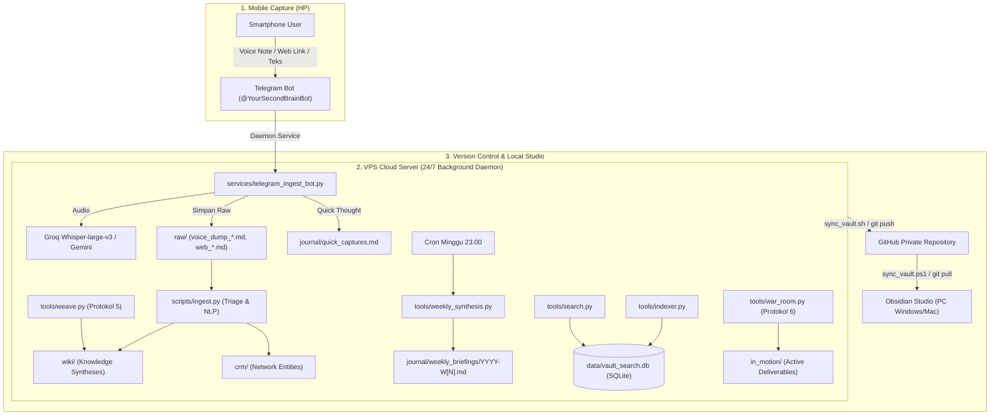

# Panduan Operasional Lengkap Second Brain OS

> **Knowledge Architecture & Autonomous Agent System for High-Concurrency Builders**  
> Terintegrasi: **HP (Telegram Bot)** $\leftrightarrow$ **VPS Ubuntu 24.04 Daemon** $\leftrightarrow$ **GitHub Remote** $\leftrightarrow$ **Obsidian PC Lokal**

---

## 🗺️ 1. Peta Ekosistem & Topologi Arsitektur



---

## ⚙️ 2. Konfigurasi Awal & File Lingkungan (`.env`)

File `.env` di VPS menyimpan seluruh kredensial rahasia (diabaikan oleh Git via `.gitignore` demi keamanan):

```ini
# Core AI Engines
GEMINI_API_KEY=AQ.Ab8RN6Iu...
GEMINI_MODEL=gemini-3.8-flash

# Telegram Daemon 24/7
TELEGRAM_BOT_TOKEN=634542972:AAHxcgPX...
TELEGRAM_ALLOWED_USER_ID=292330596

# Ultra-Fast Voice Transcription (Whisper-large-v3) & LLM Fallback
GROQ_API_KEY=gsk_xxxxxxxxxxxxxxxxxxxx
```

> [!TIP] Trik Pip Ubuntu 24.04 (PEP 668)
> Jalankan perintah berikut sekali saja di terminal VPS agar instalasi pustaka Python berjalan lancar tanpa terhalang `externally-managed-environment`:
> ```bash
> mkdir -p ~/.config/pip
> cat <<EOF > ~/.config/pip/pip.conf
> [global]
> break-system-packages = true
> EOF
> ```

---

## 📱 3. Fitur Mobile: Telegram Gateway Daemon (Input dari HP)

Daemon berjalan 24/7 di VPS menggunakan systemd service `secondbrain-telegram.service`.

### A. Cara Mengirim Input dari HP:
1. **Voice Note (VN) / Audio File**:
   - Bicara langsung di Telegram (misal: intisari rapat, ide cepat saat berjalan).
   - Bot otomatis mengunduh audio, mengirimkannya ke **Groq Whisper Large v3** (fallback ke Gemini Multimodal), dan menyimpannya sebagai Markdown di `raw/voice_dump_YYYYMMDD_HHMMSS.md` lengkap dengan tag `#voice-dump`.
2. **Tautan Web / YouTube**:
   - Kirim atau forward link URL dari browser/aplikasi HP ke bot.
   - Bot otomatis mengekstrak judul web/video YouTube dan menyimpannya di `raw/web_YYYYMMDD_HHMMSS_slug.md`.
3. **Teks Pendek / Quick Capture**:
   - Kirim pesan teks singkat (di bawah 100 karakter).
   - Bot otomatis mencatatnya dengan timestamp ke [`journal/quick_captures.md`](file:///C:/Users/tio/.gemini/antigravity/scratch/second-brain/journal/quick_captures.md).

### B. Perintah Interaktif di Chat Telegram:
- `/search <kata kunci>`: Menjalankan hybrid search instan langsung di layar Telegram dan mengembalikan kutipan catatan beserta path filenya.
- `/list`: Menampilkan 10 catatan wiki dan deliverable terbaru dengan tautan baca.
- `/read <nama_file>`: Membaca isi lengkap file markdown langsung di chat Telegram tanpa perlu menyalakan laptop.
- `/status`: Memeriksa kesehatan bot, status RAM, dan uptime sistem.

### C. Manajemen Service di VPS:
```bash
# Cek status bot:
sudo systemctl status secondbrain-telegram

# Restart bot (setelah edit .env atau kode):
sudo systemctl restart secondbrain-telegram

# Pantau log interaksi secara real-time:
sudo journalctl -u secondbrain-telegram -f
```

---

## ⚡ 4. Fitur Ingest: Autonomous Triage Pipeline (`scripts/ingest.py`)

Memproses seluruh catatan mentah di `raw/` menjadi artikel pengetahuan standar di `wiki/` dan profil kontak di `crm/`.

```bash
# 1. Masuk ke direktori vault
cd ~/second-brain

# 2. Proses seluruh file mentah di folder raw/
python3 scripts/ingest.py --all

# 3. Atau proses satu file spesifik:
python3 scripts/ingest.py --file raw/voice_dump_20260928_010000.md

# 4. Preview hasil di terminal tanpa mengubah disk:
python3 scripts/ingest.py --file raw/voice_dump_20260928_010000.md --dry-run
```

**Yang Dilakukan Pipeline Secara Otomatis:**
- Membuat YAML Frontmatter baku (`title`, `tags`, `links`, `ingest_date`).
- Mengidentifikasi konsep penting dan menghubungkannya dengan `[[wikilinks]]`.
- Mendeteksi nama tokoh/kolega dan membuat profil baru di `crm/[Nama-Tokoh].md`.
- Memindahkan file mentah ke `raw/processed/` (provenance preservasi data asli).
- Mendaftarkan entitas baru ke [`index.md`](file:///C:/Users/tio/.gemini/antigravity/scratch/second-brain/index.md) dan mencatat audit di [`log.md`](file:///C:/Users/tio/.gemini/antigravity/scratch/second-brain/log.md).

---

## 🔍 5. Fitur Search: Mesin Pencarian Hybrid Lokal (BM25 + Dense Semantic Vector)

Menggabungkan pencarian kata kunci presisi (**BM25 Okapi**) dengan pencarian semantik makna (**384-dimensional dense vectors**) menggunakan SQLite murni di `data/vault_search.db`.

### A. Pengindeksan Vault (`tools/indexer.py`):
Jalankan pengindeksan setelah Anda menambahkan banyak catatan baru atau setelah pull dari Git:
```bash
python3 tools/indexer.py
```
*Kinerja: Memindai seluruh `wiki/`, `journal/`, `crm/`, `in_motion/`, dan `lattices/`, memotong dokumen menjadi chunk berbasis heading, dan menyimpannya ke database hanya dalam ~0.4 detik.*

### B. Menjalankan Pencarian CLI (`tools/search.py`):
```bash
# Pencarian hybrid standar (menampilkan 5 hasil teratas):
python3 tools/search.py "pre-mortem kill switch"

# Mengatur jumlah hasil (top-k):
python3 tools/search.py "pitch control credit risk" --top-k 3

# Mode khusus:
python3 tools/search.py "latency optimization" --mode bm25    # Khusus kata kunci
python3 tools/search.py "model drift musiman" --mode vector   # Khusus kemiripan makna
python3 tools/search.py "LangGraph agent" --json              # Output JSON untuk otomasi
```

### C. Menjalankan Pencarian di Telegram:
Ketik langsung di chat bot:
```text
/search <kata kunci>
```
*Contoh:* `/search credit scoring musiman` atau `/search pre-mortem kill switch`

**Fitur Interaktif di Telegram:**
- Bot mengembalikan 3 hasil paling relevan dengan path file dan cuplikan intisari.
- Bot menyediakan tombol baca interaktif berformat: `/read_<slug>` (contoh: `/read_credit_scoring_musiman`).
- Cukup **klik link `/read_...` tersebut**, dan bot langsung menampilkan seluruh isi dokumen Markdown di Telegram!
- Ingin melihat daftar catatan terbaru? Ketik `/list`.

---

## 🧠 6. Fitur Audit Kognitif Mingguan (`tools/weekly_synthesis.py`)

Berjalan otomatis via cron job setiap **Minggu malam pukul 23:00** untuk membedah dinamika kognitif Anda selama 7 hari terakhir.

### A. Eksekusi via CLI:
```bash
# Menjalankan audit kognitif mingguan secara manual:
python3 tools/weekly_synthesis.py

# Memasang jadwal cron otomatis di VPS (Minggu 23:00):
python3 tools/weekly_synthesis.py --install-cron
```

### B. Eksekusi via Telegram:
Ketik di chat bot kapan saja saat Anda ingin melakukan refleksi:
```text
/weekly
```
*(Atau alias: `/audit`)*

**Yang Dikembalikan Bot ke Telegram:**
- 🏆 **Wins & Strategic Progress**: Pencapaian dan progres deliverable selama 7 hari terakhir.
- 🚧 **Recurring Obstacles**: Hambatan mental atau keluhan berulang tanpa eksekusi.
- ⚔️ **Cognitive Conflicts**: Friksi antara apa yang dicatat di jurnal dengan prinsip arsitektur sistem.
- 🎯 **3 Rekomendasi Taktis**: Tiga langkah prioritas untuk minggu depan.
- 📖 Tautan langsung untuk membaca laporan lengkap: `/read YYYY_W[Minggu_ke]`.

---

## 🕸️ 7. Fitur WEAVE: Sintesis Lintas Domain (`PROTOKOL 5`)

Menghubungkan dua bidang ilmu yang tampak tidak berkaitan untuk mengekstrak analogi struktural tingkat tinggi (*structural isomorphism*) dan mentransfer 3 solusi konkret.

### A. Eksekusi via CLI:
```bash
# Menjalankan sintesis lintas domain:
python3 tools/weave.py "Credit Risk" "Tactical Football Analytics"
python3 tools/weave.py "Data Architecture" "Behavioral Economics"

# Mode preview:
python3 tools/weave.py "Distributed Systems" "Evolutionary Biology" --dry-run
```

### B. Eksekusi via Telegram:
Ketik di chat bot menggunakan format `x`, `dan`, atau `&`:
```text
/weave <Domain A> x <Domain B>
```
*Contoh:*
- `/weave Credit Risk x Tactical Football Analytics`
- `/weave Data Architecture x Behavioral Economics`
- `/weave Distributed Systems x Evolutionary Biology`

**Yang Dikembalikan Bot ke Telegram:**
- 📌 **Tesis Isomorfik**: Ringkasan keselarasan struktural antara kedua domain.
- 🚀 **Transfer Solusi Konkret**: 3 transfer ilmu dan inovasi teknis yang bisa diterapkan.
- 📁 Disimpan otomatis di `wiki/synthesis_[A]_[B].md` dan siap dibaca via `/read`.

---

## 🛡️ 8. Fitur War Room Pre-Mortem: Red Team Decision Stress-Test (`PROTOKOL 6`)

Melakukan stress-test agresif tanpa kompromi (*zero-sugarcoating*) terhadap keputusan kritis atau rencana proyek besar sebelum Anda mengeksekusinya.

### A. Eksekusi via CLI:
```bash
# Menjalankan War Room Pre-Mortem:
python3 tools/war_room.py "Rencana migrasi pipeline data"
python3 tools/war_room.py "Strategi negosiasi dengan partner X"
python3 tools/war_room.py "Pengambilan proyek konsultasi arsitektur perbankan"

# Mode preview:
python3 tools/war_room.py "Peluncuran produk AI baru" --dry-run
```

### B. Eksekusi via Telegram:
Gunakan perintah `/warroom` atau prefix trigger:
```text
/warroom Menerima proyek konsultasi enterprise senilai Rp 150 juta dengan penalti keterlambatan
```
*(Atau ketik pesan berawalan: `war room:`, `pre-mortem:`, atau `uji keputusan:`)*

---

## 🔄 9. Fitur Sync: Sinkronisasi Multi-Perangkat (VPS ↔ PC)

Menjaga keselarasan catatan antara VPS dan Obsidian di PC lokal tanpa konflik Git.

### A. Sinkronisasi via Telegram:
Ketik langsung di chat bot:
```text
/sync
```
**Yang Dilakukan Bot Secara Otomatis:**
1. Memperbarui database pencarian hybrid (`vault_search.db`).
2. Melakukan `git add` & `git commit` atas seluruh catatan baru / voice note / laporan pre-mortem di VPS.
3. Melakukan `git push origin main` ke repositori GitHub.

### B. Sinkronisasi di PC Lokal (Obsidian):
Jalankan di PowerShell PC lokal di dalam folder `second-brain`:
```powershell
.\sync_vault.ps1
```
*(Atau `git pull origin main`). Seluruh catatan baru, transkrip voice notes, dan laporan analisis langsung muncul rapi di Obsidian!*

### C. Sinkronisasi Manual dari VPS:
```bash
./sync_vault.sh
# Atau:
git pull origin main && python3 tools/indexer.py
```

---

## 📋 10. Cheat Sheet Ringkasan Perintah (Telegram vs CLI)

| Operasi / Kategori | Perintah Telegram (HP) | Perintah CLI (VPS / PC) | Hasil & Dampak Sistem |
| :--- | :--- | :--- | :--- |
| **Quick Capture** | Kirim teks pendek biasa | `echo "- [$(date)] Catatan" >> journal/quick_captures.md` | Dicatat ke `journal/quick_captures.md` |
| **Voice Capture** | Rekam & kirim Voice Note | `python3 scripts/telegram_bot.py` | Ditranskrip Whisper ke `raw/voice_dump_*.md` |
| **Web Clip** | Kirim link URL (Web/YT) | Masuk otomatis via Telegram Ingest Bot | Ekstrak metadata ke `raw/web_*.md` |
| **Triage & Ingest** | `/ingest` atau `/proses` | `python3 scripts/ingest.py --all` | Ekstrak intisari ke `wiki/` & `crm/`, re-indexing |
| **Pencarian Hybrid** | `/search <kueri>` | `python3 tools/search.py "<kueri>"` | Cari via BM25 + dense semantic vector |
| **Jelajah Catatan** | `/list` | `ls -lt wiki/ in_motion/` | Tampilkan 10 catatan terbaru dengan tombol `/read` |
| **Baca Dokumen** | `/read <slug>` atau `/read_<slug>` | `cat wiki/<file>.md` | Baca isi dokumen Markdown langsung di Telegram |
| **Uji Keputusan (Red Team)** | `/warroom <rencana>` | `python3 tools/war_room.py "<rencana>"` | Pre-Mortem report, 3 failure modes, kill-switch |
| **Sintesis Lintas Domain** | `/weave <A> x <B>` | `python3 tools/weave.py "<A>" "<B>"` | Tesis isomorfik & 3 transfer konkret di `wiki/` |
| **Audit Kognitif Mingguan** | `/weekly` atau `/audit` | `python3 tools/weekly_synthesis.py` | Wins, recurring obstacles, & 3 rekomendasi taktis |
| **Multi-Device Sync** | `/sync` | `.\sync_vault.ps1` (PC) / `./sync_vault.sh` (VPS) | Commit & push ke GitHub, Obsidian up-to-date |
| **Status Sistem** | `/status` | `sudo systemctl status secondbrain-telegram` | Cek jumlah file, ukuran database, & engine AI |

---
*Dokumen ini diperbarui secara berkala dan disinkronkan dengan seluruh protokol otonom di [`agents.md`](file:///C:/Users/tio/.gemini/antigravity/scratch/second-brain/agents.md).*
