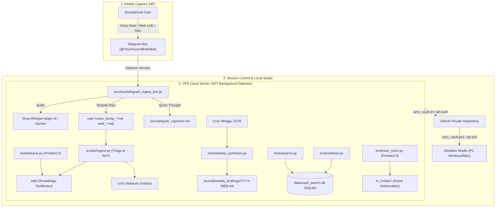

# Panduan Operasional Lengkap Second Brain OS

> **Knowledge Architecture & Autonomous Agent System for High-Concurrency Builders**  
> Terintegrasi: **HP (Telegram Bot)** $\leftrightarrow$ **VPS Ubuntu 24.04 Daemon** $\leftrightarrow$ **GitHub Remote** $\leftrightarrow$ **Obsidian PC Lokal**

---

## 🗺️ 1. Peta Ekosistem & Topologi Arsitektur



---

## ⚙️ 2. Konfigurasi Awal & File Lingkungan (`.env`)

File `.env` di VPS menyimpan seluruh kredensial rahasia (diabaikan oleh Git via `.gitignore` demi keamanan):

```ini
# Core AI Engines
GEMINI_API_KEY=AQ.Ab8RN6Iu...
GEMINI_MODEL=gemini-3.8-flash

# Telegram Daemon 24/7
TELEGRAM_BOT_TOKEN=634542972:AAHxcgPX...
TELEGRAM_ALLOWED_USER_ID=292330596

# Ultra-Fast Voice Transcription (Whisper-large-v3) & LLM Fallback
GROQ_API_KEY=gsk_xxxxxxxxxxxxxxxxxxxx
```

> [!TIP] Trik Pip Ubuntu 24.04 (PEP 668)
> Jalankan perintah berikut sekali saja di terminal VPS agar instalasi pustaka Python berjalan lancar tanpa terhalang `externally-managed-environment`:
> ```bash
> mkdir -p ~/.config/pip
> cat <<EOF > ~/.config/pip/pip.conf
> [global]
> break-system-packages = true
> EOF
> ```

---

## 📱 3. Fitur Mobile: Telegram Gateway Daemon (Input dari HP)

Daemon berjalan 24/7 di VPS menggunakan systemd service `secondbrain-telegram.service`.

### A. Cara Mengirim Input dari HP:
1. **Voice Note (VN) / Audio File**:
   - Bicara langsung di Telegram (misal: intisari rapat, ide cepat saat berjalan).
   - Bot otomatis mengunduh audio, mengirimkannya ke **Groq Whisper Large v3** (fallback ke Gemini Multimodal), dan menyimpannya sebagai Markdown di `raw/voice_dump_YYYYMMDD_HHMMSS.md` lengkap dengan tag `#voice-dump`.
2. **Tautan Web / YouTube**:
   - Kirim atau forward link URL dari browser/aplikasi HP ke bot.
   - Bot otomatis mengekstrak judul web/video YouTube dan menyimpannya di `raw/web_YYYYMMDD_HHMMSS_slug.md`.
3. **Teks Pendek / Quick Capture**:
   - Kirim pesan teks singkat (di bawah 100 karakter).
   - Bot otomatis mencatatnya dengan timestamp ke [`journal/quick_captures.md`](file:///C:/Users/tio/.gemini/antigravity/scratch/second-brain/journal/quick_captures.md).

### B. Perintah Interaktif di Chat Telegram:
- `/search <kata kunci>`: Menjalankan hybrid search instan langsung di layar Telegram dan mengembalikan kutipan catatan beserta path filenya.
- `/list`: Menampilkan 10 catatan wiki dan deliverable terbaru dengan tautan baca.
- `/read <nama_file>`: Membaca isi lengkap file markdown langsung di chat Telegram tanpa perlu menyalakan laptop.
- `/status`: Memeriksa kesehatan bot, status RAM, dan uptime sistem.

### C. Manajemen Service di VPS:
```bash
# Cek status bot:
sudo systemctl status secondbrain-telegram

# Restart bot (setelah edit .env atau kode):
sudo systemctl restart secondbrain-telegram

# Pantau log interaksi secara real-time:
sudo journalctl -u secondbrain-telegram -f
```

---

## ⚡ 4. Fitur Ingest: Autonomous Triage Pipeline (`scripts/ingest.py`)

Memproses seluruh catatan mentah di `raw/` menjadi artikel pengetahuan standar di `wiki/` dan profil kontak di `crm/`.

```bash
# 1. Masuk ke direktori vault
cd ~/second-brain

# 2. Proses seluruh file mentah di folder raw/
python3 scripts/ingest.py --all

# 3. Atau proses satu file spesifik:
python3 scripts/ingest.py --file raw/voice_dump_20260928_010000.md

# 4. Preview hasil di terminal tanpa mengubah disk:
python3 scripts/ingest.py --file raw/voice_dump_20260928_010000.md --dry-run
```

**Yang Dilakukan Pipeline Secara Otomatis:**
- Membuat YAML Frontmatter baku (`title`, `tags`, `links`, `ingest_date`).
- Mengidentifikasi konsep penting dan menghubungkannya dengan `[[wikilinks]]`.
- Mendeteksi nama tokoh/kolega dan membuat profil baru di `crm/[Nama-Tokoh].md`.
- Memindahkan file mentah ke `raw/processed/` (provenance preservasi data asli).
- Mendaftarkan entitas baru ke [`index.md`](file:///C:/Users/tio/.gemini/antigravity/scratch/second-brain/index.md) dan mencatat audit di [`log.md`](file:///C:/Users/tio/.gemini/antigravity/scratch/second-brain/log.md).

---

## 🔍 5. Fitur Search: Mesin Pencarian Hybrid Lokal (BM25 + Dense Semantic Vector)

Menggabungkan pencarian kata kunci presisi (**BM25 Okapi**) dengan pencarian semantik makna (**384-dimensional dense vectors**) menggunakan SQLite murni di `data/vault_search.db`.

### A. Pengindeksan Vault (`tools/indexer.py`):
Jalankan pengindeksan setelah Anda menambahkan banyak catatan baru atau setelah pull dari Git:
```bash
python3 tools/indexer.py
```
*Kinerja: Memindai seluruh `wiki/`, `journal/`, `crm/`, `in_motion/`, dan `lattices/`, memotong dokumen menjadi chunk berbasis heading, dan menyimpannya ke database hanya dalam ~0.4 detik.*

### B. Menjalankan Pencarian CLI (`tools/search.py`):
```bash
# Pencarian hybrid standar (menampilkan 5 hasil teratas):
python3 tools/search.py "pre-mortem kill switch"

# Mengatur jumlah hasil (top-k):
python3 tools/search.py "pitch control credit risk" --top-k 3

# Mode khusus:
python3 tools/search.py "latency optimization" --mode bm25    # Khusus kata kunci
python3 tools/search.py "model drift musiman" --mode vector   # Khusus kemiripan makna
python3 tools/search.py "LangGraph agent" --json              # Output JSON untuk otomasi
```

---

## 🧠 6. Fitur Audit Kognitif Mingguan (`tools/weekly_synthesis.py`)

Berjalan otomatis via cron job setiap **Minggu malam pukul 23:00** untuk membedah dinamika kognitif Anda selama 7 hari terakhir.

```bash
# Menjalankan audit kognitif mingguan secara manual:
python3 tools/weekly_synthesis.py

# Memasang jadwal cron otomatis di VPS (Minggu 23:00):
python3 tools/weekly_synthesis.py --install-cron
```

**Output Deliverable:**  
Menghasilkan briefing strategis di [`journal/weekly_briefings/YYYY-W[Minggu_ke].md`](file:///C:/Users/tio/.gemini/antigravity/scratch/second-brain/journal/weekly_briefings/2026-W40.md) dengan analisis:
1. **Wins & Progress**: Milestone dan pencapaian deliverable aktif.
2. **Recurring Obstacles**: Hambatan berulang tanpa tindakan nyata yang terdeteksi di catatan jurnal.
3. **Cognitive Conflicts**: Kontradiksi antara apa yang ditulis di jurnal dengan prinsip arsitektur sistem.
4. **Orphan Concepts Detector**: Mendeteksi catatan di `wiki/` yang memiliki 0 tautan masuk (*backlinks*) agar tidak menjadi konsep mati.
5. **3 Rekomendasi Taktis**: Aksi prioritas untuk 7 hari ke depan.

---

## 🕸️ 7. Fitur WEAVE: Sintesis Lintas Domain (`PROTOKOL 5`)

Menghubungkan dua bidang ilmu yang tampak tidak berkaitan untuk mengekstrak analogi struktural tingkat tinggi (*structural isomorphism*) dan mentransfer 3 solusi konkret.

```bash
# Menjalankan sintesis lintas domain:
python3 tools/weave.py "Credit Risk" "Tactical Football Analytics"
python3 tools/weave.py "Data Architecture" "Behavioral Economics"

# Mode preview:
python3 tools/weave.py "Distributed Systems" "Evolutionary Biology" --dry-run
```

**Output Deliverable:**  
Menghasilkan file di [`wiki/synthesis_[TopikA]_[TopikB].md`](file:///C:/Users/tio/.gemini/antigravity/scratch/second-brain/wiki/synthesis_credit-risk_tactical-football-analytics.md):
- **Tesis Analogi**: Penjelasan sistemik mengapa kedua domain tersebut isomorfik.
- **Matriks Isomorfik**: Tabel komparasi dimensi sistem.
- **3 Transfer Ilmu Konkret**: Solusi teknis bagaimana disiplin B memecahkan masalah kronis di domain A.
- **Implikasi Eksekusi**: Rekomendasi playbook dan prototipe di `in_motion/`.
- Otomatis terhubung ke MOC Index dan database pencarian SQLite.

---

## 🛡️ 8. Fitur War Room Pre-Mortem: Red Team Decision Stress-Test (`PROTOKOL 6`)

Melakukan stress-test agresif tanpa kompromi (*zero-sugarcoating*) terhadap keputusan kritis atau rencana proyek besar sebelum Anda mengeksekusinya.

```bash
# Menjalankan War Room Pre-Mortem:
python3 tools/war_room.py "Rencana migrasi pipeline data"
python3 tools/war_room.py "Strategi negosiasi dengan partner X"
python3 tools/war_room.py "Pengambilan proyek konsultasi arsitektur perbankan"

# Mode preview:
python3 tools/war_room.py "Peluncuran produk AI baru" --dry-run
```

**Grounding Vault Otomatis:**
- Menelusuri `journal/` untuk menemukan bias kognitif dan titik stres masa lalu (*cognitive overflow, lupa komitmen rapat*).
- Menelusuri `crm/` untuk menemukan kontak relevan yang dapat dijadikan *sounding board* kritis.
- Menelusuri `wiki/` & `lattices/` untuk menemukan batasan teknis dan SLA latensi.

**Output Deliverable:**  
Menghasilkan dokumen analisis di [`in_motion/war_room_[nama_proyek].md`](file:///C:/Users/tio/.gemini/antigravity/scratch/second-brain/in_motion/war_room_rencana_migrasi_pipeline_data.md):
- **Tesis Retrospektif**: Analisis dari masa depan mengapa proyek ini hancur total jika dieksekusi tanpa pengaman.
- **3 Failure Modes**: Skenario kegagalan paling realistis beserta *leading indicator* (tanda bahaya awal).
- **Unstated Assumptions Table**: Asumsi terselubung vs fakta lapangan yang membantahnya.
- **5 Blindspot Questions**: Pertanyaan tanpa kompromi yang wajib Anda jawab.
- **Actionable Mitigations**: Protokol mitigasi dengan batas kuantitatif tegas (*kill-switch thresholds*, misal: PSI > 0.20, Latensi > 1500ms).

---

## 🔄 9. Fitur Sync: Sinkronisasi Multi-Perangkat (VPS $\leftrightarrow$ PC)

Menjaga keselarasan catatan antara VPS dan Obsidian di PC lokal tanpa konflik Git.

### Dari PC Lokal (Windows PowerShell):
```powershell
# Jalankan skrip sinkronisasi otomatis:
.\sync_vault.ps1

# Atau manual:
git add .
git commit -m "chore(sync): update notes from local"
git push origin main
```

### Dari VPS Ubuntu:
```bash
# Jalankan skrip sinkronisasi otomatis:
./sync_vault.sh

# Atau manual:
git pull origin main
python3 tools/indexer.py
```

---

## 📋 10. Cheat Sheet Ringkasan Perintah CLI

| Perintah | Deskripsi Singkat |
| :--- | :--- |
| `python3 tools/search.py "kueri"` | Mencari catatan di seluruh vault dengan Hybrid Search (BM25 + Vektor). |
| `python3 tools/indexer.py` | Memperbarui database pencarian lokal SQLite di `data/vault_search.db`. |
| `python3 scripts/ingest.py --all` | Mengolah file mentah di `raw/` menjadi artikel `wiki/` dan profil `crm/`. |
| `python3 tools/weekly_synthesis.py` | Menjalankan audit kognitif mingguan dan mendeteksi catatan terisolasi. |
| `python3 tools/weave.py "A" "B"` | Membuat sintesis analogi struktural dan transfer ilmu lintas domain. |
| `python3 tools/war_room.py "Keputusan"` | Menjalankan simulasi Pre-Mortem Red Team untuk keputusan kritis. |
| `sudo systemctl status secondbrain-telegram` | Memeriksa status kesehatan bot Telegram 24/7 di VPS. |
| `sudo systemctl restart secondbrain-telegram` | Merestart daemon bot Telegram setelah perubahan konfigurasi `.env`. |
| `./sync_vault.sh` | Sinkronisasi otomatis repositori vault ke GitHub. |

---
*Dokumen ini diperbarui secara berkala dan disinkronkan dengan seluruh protokol otonom di [`agents.md`](file:///C:/Users/tio/.gemini/antigravity/scratch/second-brain/agents.md).*
