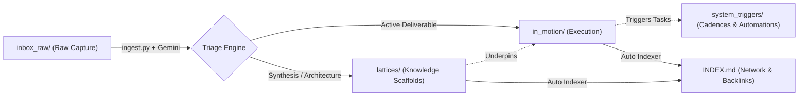

# Second Brain: Momentum & Deliverable-Driven Knowledge OS

> **Customized Knowledge Architecture for High-Concurrency Builders & AI Engineers.**
> Diselaraskan secara khusus untuk pola kerja *deliverable-first*, konkurensi tinggi (paralel kerja & side-project builder), visual rapi, dan orientasi eksekusi sampai tahap deployment.

---

## 1. Arsitektur Kognitif

Berbeda dengan model PARA tradisional yang pasif, sistem ini mengalirkan ide berdasarkan **momentum eksekusi**:



| Direktori | Fungsi Utama | Karakteristik |
| :--- | :--- | :--- |
| `inbox_raw/` | Quick capture, voice notes, transkrip mentah, chat dump | Zero friction, append-only, dibersihkan setelah ingest |
| `in_motion/core_work/` | Deliverables profesional, proyek enterprise, target klien | Milestones terukur, SLA, deliverables-first |
| `in_motion/side_builder/` | Side-projects, eksperimen AI agents, riset SaaS | Cepat, iteratif, target: deploy atau live agent |
| `lattices/mental_models/` | Kerangka analitis, prinsip sistem, mental models | Abadi, sintetis, modular |
| `lattices/playbooks/` | Engineering SOP, checklist arsitektur, pattern teruji | Reusable blueprints & operational scripts |
| `system_triggers/` | Template markdown, cadences mingguan, automation scripts | Engine yang menjaga momentum tetap bergerak |

---

## 2. CLI Automation Suite

Repositori ini dilengkapi dengan utilitas CLI bawaan Python Standard Library (zero mandatory pip dependencies) yang terintegrasi dengan Google Gemini AI untuk analisis cerdas.

### A. Pipeline Ingest Catatan Mentah (`ingest.py`)
Memproses file teks di `inbox_raw/`, mengekstrak **Core Insight**, **Key Entities** (sebagai `[[wikilinks]]`), **Action Items/Triggers**, lalu menghasilkan catatan Markdown siap pakai.

```bash
# Memproses satu catatan tertentu
python scripts/ingest.py --file inbox_raw/draft-note.md

# Memproses seluruh isi folder inbox_raw secara otomatis
python scripts/ingest.py --all

# Mode dry-run (tampilkan hasil di terminal tanpa menulis file)
python scripts/ingest.py --file inbox_raw/draft-note.md --dry-run
```

*Tersedia juga helper script one-liner:*
- Linux/VPS: `./scripts/process_dump.sh`
- Windows: `.\scripts\process_dump.ps1`

### B. Graph Indexer & Local Semantic Search (`graph_index.py`)
Memindai seluruh vault, memetakan hubungan dua arah (*forward links*, *backlinks*, dan *dangling links*), serta memperbarui `INDEX.md`.

```bash
# Membangun kembali indeks jaringan (INDEX.md)
python scripts/graph_index.py build

# Pencarian semantik lokal berbasis BM25 / TF-IDF
python scripts/graph_index.py search "autonomous agent deployment"
```

---

## 3. Integrasi Obsidian & Neovim

### Obsidian
1. Buka Obsidian -> **Open folder as vault** -> pilih folder repositori ini.
2. Aktifkan fitur inti: **Graph View**, **Backlinks**, dan **Outgoing Links**.
3. Rekomendasi Community Plugins:
   - `Dataview`: Kueri status catatan otomatis berdasarkan YAML frontmatter.
   - `Omnisearch`: Pencarian teks mendalam.

### Neovim
1. Kompatibel dengan plugin Markdown modern:
   - `epwalsh/obsidian.nvim`
   - `renerocksai/telekasten.nvim`
   - `nvim-telescope/telescope.nvim`
2. Konfigurasi `obsidian.nvim` contoh:
   ```lua
   require("obsidian").setup({
     workspaces = {
       {
         name = "second-brain",
         path = "~/second-brain",
       },
     },
     wiki_link_func = "use_alias_only",
   })
   ```

---

## 4. Aturan & Governance

Lihat [RULES.md](file:///C:/Users/tio/.gemini/antigravity/scratch/second-brain/RULES.md) untuk detail lengkap mengenai skema frontmatter, konvensi penamaan file, dan standarisasi visual.
