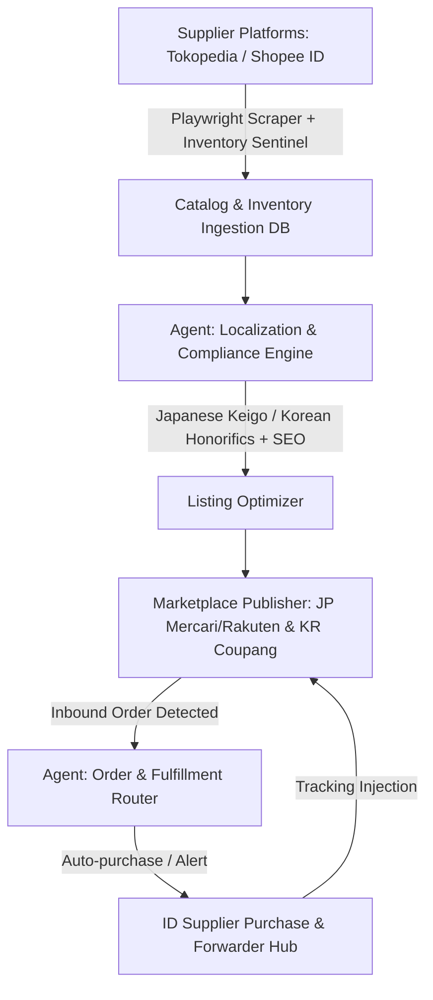

# Autonomous Cross-Border Dropshipping Agent: ID to JP/KR

## 1. Executive Summary
Sistem agen AI otonom yang mengoperasikan siklus end-to-end dropshipping lintas negara: mengekstraksi inventaris bernilai tinggi dari marketplace Indonesia (Tokopedia, Shopee), menerjemahkan serta melokalkan listing produk secara kontekstual ke bahasa Jepang dan Korea, memublikasikan katalog ke target marketplace (Rakuten, Mercari, Coupang, Naver Smartstore), serta mengotomatisasi order routing dan customer support.

---

## 2. Platform & Market Feasibility Matrix

| Region | Target Marketplace | Target Product Category | Barrier to Entry | Critical Risk Vector |
| :--- | :--- | :--- | :--- | :--- |
| **Japan (JP)** | Mercari, Yahoo! Flea, Rakuten | Kriya kayu/rotan, Batik artisan, Kopi Specialty, Herbal jamu | High (SMS/Bank Verification JP, strict returns) | Handling time SLA violation & high shipping cost |
| **Korea (KR)** | Coupang, Naver Smartstore, Bunjang | Coffee beans, organic snacks, natural cosmetic ingredients | Very High (Korean Resident Number / Business Reg) | Strict PCCC (Personal Customs Clearance Code) requirements |
| **Sourcing (ID)** | Tokopedia, Shopee, Direct UMKM | High-reputation sellers (>4.8 rating, >100 sales) | Low | Stock mismatch, unpredictable supplier fulfillment delay |

---

## 3. Autonomous Multi-Agent Core Components

### Agent 1: Catalog & Price Arb Sentinel
* **Fungsi:** Monitor stok supplier lokal, mendeteksi diskon, dan menghitung dynamic pricing formula:
  $$\text{Target Price} = (\text{IDR Cost} + \text{Freight ID\to JP/KR} + \text{Pack Fee}) \times (1 + \text{Margin Target}) \times (1 + \text{FX Volatility Buffer})$$
* **Stack:** Python, Playwright/Browserbase, PostgreSQL, Redis.

### Agent 2: Cross-Border Localization & SEO Synthesizer
* **Fungsi:** Transformasi title, bullet points, dan visual text image dari Bahasa Indonesia ke target culture:
  * *Jepang:* Penggunaan nada bicara formal (*Keigo*), deskripsi dimensi ultra-presisi (cm/g), material disclosure.
  * *Korea:* Layout visual long-form vertical (*Detail Page / Tong-image*), penekanan sertifikasi keamanan/kualitas.
* **Stack:** Claude 3.5 Sonnet / GPT-4o dengan function calling terstruktur (JSON schema output).

### Agent 3: Transaction & Fulfillment Orchestrator
* **Fungsi:** Menangkap order webhook dari JP/KR, trigger pembelian ke supplier ID via automated checkout atau alert API, serta mengintegrasikan nomor resi internasional (warehouse forwarding transit tracking).

---

## 4. Execution Roadmap

- [ ] **Phase 1: Legal & Identity Infrastructure**
  - [ ] Validasi jalur registrasi seller JP/KR (Entity proxy, individual merchant cross-border, atau platform aggregator seperti Shopee Cross-Border / Qoo10 JP).
- [ ] **Phase 2: Scraper & Data Pipeline MVP**
  - [ ] Bangun headless scraper untuk 50 SKU terkurasi dari Tokopedia.
  - [ ] Implementasikan pipeline LLM structured translation (ID -> JP/KR) lengkap dengan kalkulator margin otomatis.
- [ ] **Phase 3: Storefront Integration & Pilot Run**
  - [ ] Deploy listing otomatis ke 1 target platform (rekomendasi: Qoo10 JP atau Mercari JP via browser automation).
  - [ ] Uji coba single live order fulfillment end-to-end via freight forwarder Jakarta.