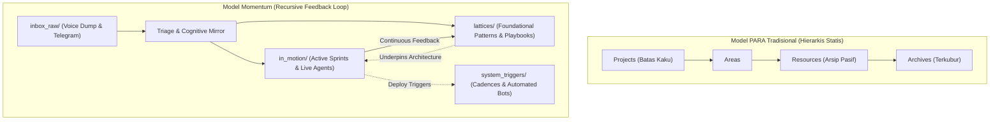

# Identity Debugging Walk & Cognitive Mirror Protocol

## 1. Executive Summary & Core Thesis
Sistem *Second Brain* generik (seperti metode PARA klasik oleh Tiago Forte) gagal bagi pemikir bertipe *builder* karena mengasumsikan kategorisasi statis, hierarkis, dan linier (*Projects, Areas, Resources, Archives*). 

Kognisi builder sejati bersifat **rekursif (*recursive*), berorientasi keluaran (*deliverable-driven*), dan berbasis momentum**. Agar sebuah sistem manajemen pengetahuan dapat bertahan dan benar-benar digunakan, ia harus dirancang bukan dari template eksternal yang diunduh, melainkan sebagai cerminan langsung (*mirror*) dari arsitektur kognitif pemiliknya melalui **Debugging Walk Input Protocol**.

> *"If knowledge is stored statically, it dies. Wisdom without deployment is just cognitive noise."*

---

## 2. Anatomis Kegagalan PARA Tradisional vs. Momentum OS

| Dimensi | Model PARA Tradisional (Tiago Forte) | Model Momentum Second Brain (Kognisi Builder) |
| :--- | :--- | :--- |
| **Struktur Organisasi** | Hierarki folder kaku (Folder dalam folder) | Topologi dangkal ($\le 2$ level): `in_motion/`, `lattices/` |
| **Status Pengetahuan** | Arsip statis (*storage of finished items*) | *Stored in Motion* (hanya disimpan jika memiliki daya dorong eksekusi) |
| **Relasi Antar Ide** | Daftar taksonomi terisolasi (*siloed lists*) | Jaringan graf hidup (*live lattice*) via `[[wikilinks]]` dua arah |
| **Siklus Evaluasi** | Review mingguan berbasis checklist tugas pasif | *Delivery Pulse & System Triggers* yang memicu deploy nyata |
| **Modalitas Input** | Ketik manual rapi di depan laptop | *Frictionless Capture*: Voice Note Telegram, mobile dump, audio transkrip |

---

## 3. Tiga Aturan Emas Arsitektur Pengetahuan Rekursif

1. **Stored in Motion (Harus Bergerak atau Mati)**:
   Catatan tidak boleh disimpan hanya untuk "dibaca nanti". Setiap ide baru harus langsung diproyeksikan ke target konkret: apakah ia deliverable aktif ([`in_motion`](file:///C:/Users/tio/.gemini/antigravity/scratch/second-brain/in_motion)) atau fondasi arsitektur ([`lattices`](file:///C:/Users/tio/.gemini/antigravity/scratch/second-brain/lattices)).
2. **Live Lattice, Not a List (Kisi-kisi Jaringan, Bukan Daftar)**:
   Pengetahuan tidak hidup di dalam folder, melainkan pada **keterhubungan antar nodus**. Setiap catatan wajib memiliki tautan dua arah (`[[...]]`) ke playbook operasional atau model mental acuan.
3. **Identity & System Alignment (Menjawab Pemicu Identitas)**:
   Setiap catatan wajib menjawab pertanyaan sistemik: *"Sistem, proyek, atau identitas apa yang sedang digerakkan oleh catatan ini?"*.

---

## 4. Protokol Debugging Walk (Spesifikasi Operasional)

### Konsep Inti
Tes kepribadian atau kuesioner adalah "cermin yang buruk" (*bad mirrors*) karena mengukur persepsi sadar yang telah disaring (*filtered ego*). Sinyal kognitif asli manusia hanya muncul dari **suara mentah sebelum diedit (*raw voice before edit*)**.

### Langkah Pelaksanaan
1. **Durasi & Waktu**: 30 menit berjalan kaki di ruang terbuka (pagi hari, saat kondisi mental stabil).
2. **Instrumen**: Perekam suara smartphone (Otter, Voice Memo, atau langsung kirim VN ke Bot Telegram Second Brain).
3. **Aturan Bicara**: Berbicara tanpa jeda, tanpa skenario, tanpa rem (*unveiled stream-of-consciousness*). Konten yang dibahas tidak penting; yang dipetakan adalah **struktur alur berpikir**.
4. **Ekstraksi Sinyal AI (6 Diagnostic Cognitive Signals)**:
   - **Processing Speed**: Tempo pemrosesan ide (cepat, melompat, atau metodis).
   - **Emotional Framing**: Nada dasar saat menghadapi hambatan (analitis, frustrasi, antisipatif).
   - **Structural Mode**: Cara menyusun solusi (modular sistemik vs naratif).
   - **Self-Dialogue**: Percakapan internal saat mengevaluasi risiko.
   - **Energy Shape**: Apa yang memicu lonjakan energi dan apa yang menguras daya fokus.
   - **Default Obstacles**: Jebakan friksi berulang (misal: terjebak merapikan folder alih-alih merilis kode).

---

## 5. Systemic Alignment: Sistem, Proyek, dan Identitas yang Digerakkan

Catatan ini menjawab langsung 3 dimensi penggerak:

### A. Identitas yang Digerakkan
- **Identitas**: *The Recursive Builder & AI Systems Architect*.
- Bukan arsiparis pasif (*not a passive archivist*). Menolak wacana teoritis yang berhenti tanpa eksekusi; setiap pemikiran ditujukan untuk melahirkan artefak hidup (kode, agen AI, microservice, sistem otomatis).

### B. Sistem yang Digerakkan
- **Sistem**: *Momentum-Driven Second Brain Knowledge OS*.
- Dokumen ini menjadi **Mental Model #1** yang memvalidasi mengapa arsitektur folder kita menggunakan `inbox_raw/`, `in_motion/`, `lattices/`, dan `system_triggers/`, serta mengapa integrasi Telegram Voice Note dibuat zero-friction.

### C. Proyek yang Digerakkan
- **Workstreams Terhubung**:
  - `[[autonomous-agent-eval-harness]]`: Arsitektur pengujian agen tanpa campur tangan manual.
  - `[[ai-agent-coupon-promo-indonesia]]`: Eksperimen agen side-builder scraping kupon otomatis.
  - `[[autonomous-crossborder-dropship-agent]]`: Eksperimen agen marketplace lintas negara.
  - `[[weekly-pulse]]`: Review mingguan untuk memastikan tidak ada ide yang membusuk di arsip.

---

## 6. Jaringan Relasi Terkait (Backlinks & Lattices)
- Model Mental Induk: [`[[RULES]]`](file:///C:/Users/tio/.gemini/antigravity/scratch/second-brain/RULES.md)
- Playbook Evaluasi Sistem: [`[[eval-harness-v1]]`](file:///C:/Users/tio/.gemini/antigravity/scratch/second-brain/lattices/playbooks/eval-harness-v1.md)
- Playbook Optimasi Latensi: [`[[latency-optimization-playbook]]`](file:///C:/Users/tio/.gemini/antigravity/scratch/second-brain/lattices/playbooks/latency-optimization-playbook.md)
- Pemicu Cadence Eksekusi: [`[[weekly-pulse]]`](file:///C:/Users/tio/.gemini/antigravity/scratch/second-brain/system_triggers/cadences/weekly-pulse.md)
