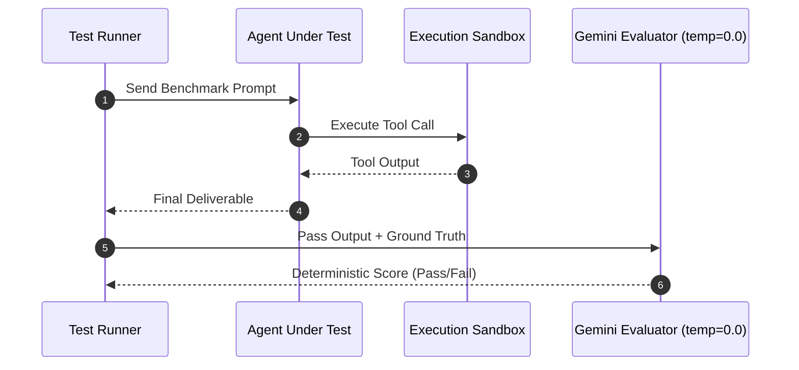

# Agent Evaluation Harness Architecture Pattern

## 1. Core Thesis & Problem Space
Mengevaluasi LLM agent dalam pipeline produksi membutuhkan pemisahan ketat antara *generation runtime* dan *evaluation harness*. Tanpa evaluasi deterministik berbasis unit test kode dan semantic judging, regresi penalaran (*reasoning regression*) sulit dideteksi sebelum menyentuh klien.

---

## 2. Technical Blueprint

---

## 3. Rules of Thumb
1. **Determinism First**: Evaluasi sintaks dan status exit code selalu didahulukan sebelum evaluasi semantik dengan LLM.
2. **Batch Isolation**: Setiap skenario pengujian harus berjalan dalam sandbox terisolasi untuk menghindari state pollution.
3. **Budget Guard**: Batasi token generation maksimal per langkah evaluasi.
