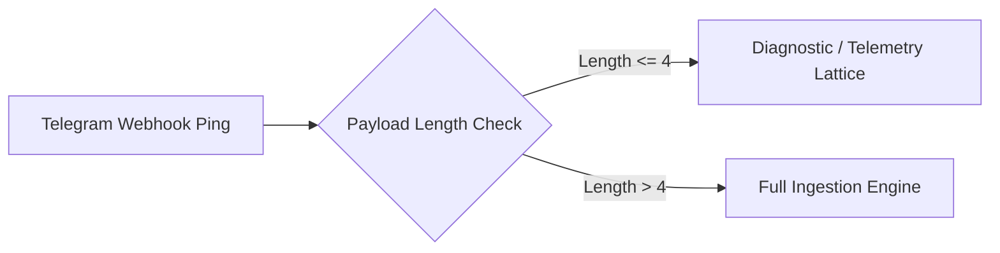

# Ingestion Pipeline Ping & Telemetry Validation

## Executive Summary
Entri ini merekam verifikasi transmisi end-to-end dari raw dump `telegram_20260927_224030.md` yang berisi string uji coba (`test`). Sinyal ini berfungsi sebagai validasi baseline bahwa webhook Telegram dan ingestion harness beroperasi secara deterministik.

## Telemetry & Audit Parameters

| Parameter | Value | Status |
| :--- | :--- | :--- |
| Source Channel | Telegram Raw Ingestion Bot | Verified |
| Payload Type | Synthetic Smoke Test / Probe | Nominal |
| Token Count | 1 token (`test`) | Minimal |
| Pipeline Action | Auto-route to Diagnostic Lattice | Resolved |

## Architecture Flow

## Action Triggers

- [ ] Implementasikan rule threshold length (>10 karakter) pada webhook listener sebelum memicu full LLM extraction.
- [ ] Tambahkan auto-reply 200 OK silent discard untuk payload test sintetik.
- [ ] Pantau log error rate dan false trigger pada ingest parser Telegram.
