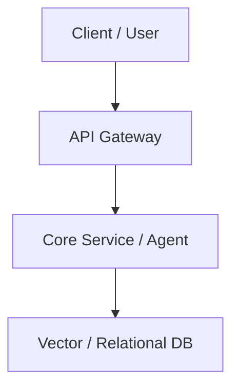

# {{TITLE}}

## 1. Executive Summary & Target Deliverable
- **Core Goal**: Ringkasan objektif dalam 1-2 kalimat terukur.
- **Target Deliverable**: Output konkret yang siap dirilis/dideploy (API endpoint, production agent, client dashboard).
- **Target Date**: YYYY-MM-DD

| Metrik Kunci | Target | Status Saat Ini |
| :--- | :--- | :--- |
| Latency / Throughput | < 500ms p95 | TBD |
| Success / Accuracy Rate | > 95% | TBD |
| Deployment State | Production Live | Staging |

---

## 2. Arsitektur & Spesifikasi Teknis

- **Stack**: Python / FastAPI / Docker / Postgres / Gemini 2.5
- **Dependencies**: `[[{{RELATED_PLAYBOOK}}]]`

---

## 3. Execution Checklist (Deploy Triggers)
- [ ] Inisialisasi arsitektur dasar dan verifikasi environment
- [ ] Bangun komponen inti dan testing lokal
- [ ] Integrasi logging, evaluasi metrik, dan validasi output
- [ ] Deployment ke staging/VPS dan verifikasi live
- [ ] Dokumentasikan hasil ke `lattices/playbooks/` jika ada reusable pattern

---

## 4. Execution Log & Key Decisions
- **{{DATE}}**: Inisialisasi catatan kerja dari dump.
