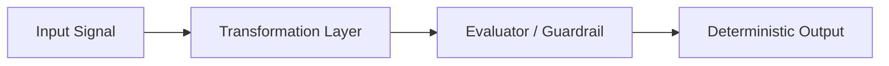

# {{TITLE}}

## 1. Core Thesis & Technical Definition
- **Prinsip Utama**: Penjelasan padat mengenai model mental atau pola arsitektur ini.
- **Problem Space**: Mengapa pola ini diperlukan dan apa kegagalan yang dicegah.

---

## 2. Blueprint & Diagram Arsitektur

---

## 3. Battle-Tested Rules of Thumb
1. **Aturan 1**: Selalu prioritaskan determinisme dan graceful fallback sebelum menambahkan kompleksitas AI.
2. **Aturan 2**: Pisahkan pipeline ingest data mentah dari pipeline reasoning aktif.
3. **Aturan 3**: Hindari abstraksi dini jika variasi kasus belum melebihi 3 implementasi.

---

## 4. Penerapan Nyata & Implementasi Referensi
- Implementasi aktif: `[[{{ACTIVE_PROJECT}}]]`
- Dokumentasi acuan: `[[{{REFERENCE_PLAYBOOK}}]]`
