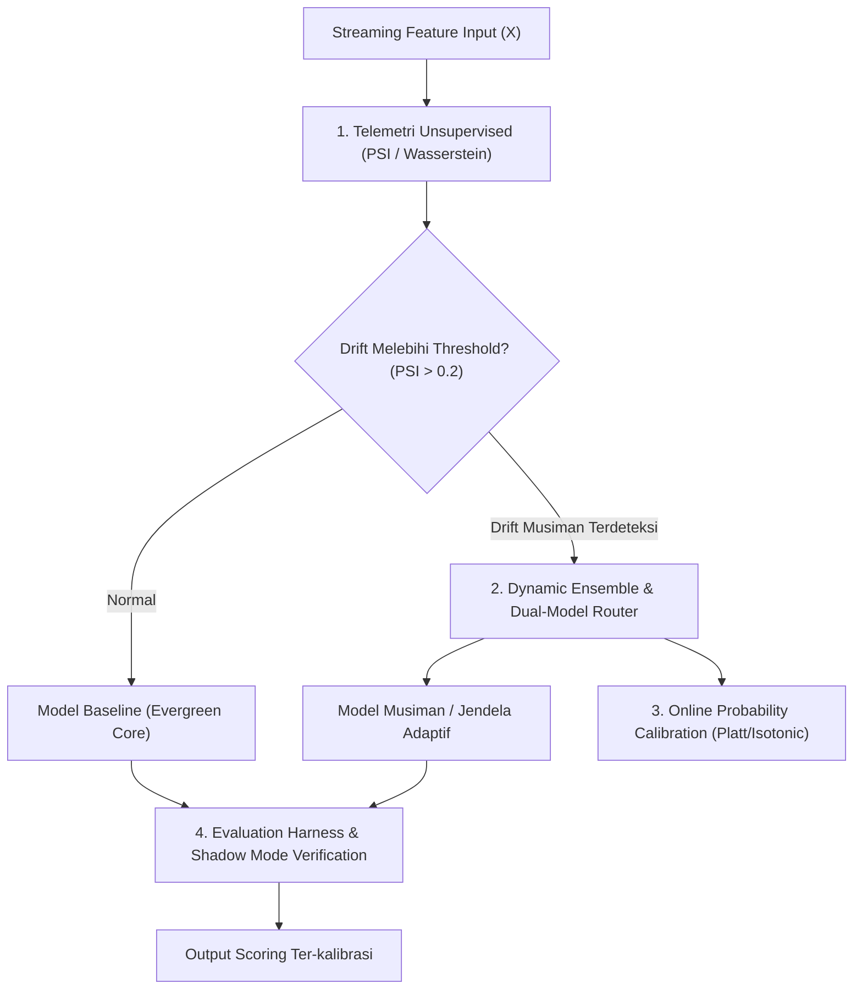

# Strategi Penanganan Degradasi Performa Model Scoring pada Pergeseran Data Musiman

## 1. Executive Summary & Root Cause Analysis
Degradasi performa (*model performance decay*) pada model scoring (misal: credit scoring, fraud detection, conversion propensity, atau demand scoring) saat pergantian musim umumnya dipicu oleh dua fenomena:
1. **Covariate Shift / Feature Drift ($P(X)$ berubah)**: Distribusi variabel input bergeser akibat lonjakan musiman (misal: volume belanja Harbolnas, fluktuasi cash-flow Ramadhan, seasonal holiday).
2. **Concept Drift ($P(Y|X)$ berubah)**: Relasi antara fitur input dengan probabilitas target berubah secara temporer (misal: sensitivitas terhadap diskon atau default rate mengalami anomali sesaat).
3. **Tantangan Delayed Ground Truth**: Label aktual target seringkali baru terkonfirmasi berminggu-minggu kemudian, sehingga pemantauan berbasis metrik supervised tradisional (AUC-ROC, F1, KS-Score) akan terlambat mendeteksi degradasi.

---

## 2. Framework Strategis 4 Pilar (Compounded Architecture)

---

### Pilar 1: Early-Warning Telemetry (Pre-Ground Truth Monitoring)
Sesuai prinsip telemetri di [`[[autonomous-agent-eval-harness]]`](file:///C:/Users/tio/.gemini/antigravity/scratch/second-brain/in_motion/side_builder/autonomous-agent-eval-harness.md), deteksi degradasi tidak boleh menunggu kedatangan label aktual:
- **Population Stability Index (PSI)** pada output skor dan fitur utama:
  $$\text{PSI} = \sum \left( \text{Actual}\% - \text{Expected}\% \right) \times \ln\left(\frac{\text{Actual}\%}{\text{Expected}\%}\right)$$
  - $\text{PSI} < 0.1$: Stabil / Tidak ada pergeseran berarti.
  - $0.1 \le \text{PSI} \le 0.2$: Pergeseran moderat (aktifkan monitoring harian).
  - $\text{PSI} > 0.2$: Pergeseran signifikan $\rightarrow$ Pemicu otomatis *switch* mode musiman.
- **Two-Sample Kolmogorov-Smirnov (KS) Test & Wasserstein Distance** untuk mendeteksi pergeseran bentuk distribusi numerik per batch 7-harian.

---

### Pilar 2: Dual-Model Regime & Adaptive Ensemble Routing
Alih-alih melakukan retrain total yang rawan *overfitting* pada *noise* musiman jangka pendek:
1. **Evergreen Core Model**: Dilatih pada data historis multi-tahun non-musiman untuk menangkap relasi fundamental stabil.
2. **Seasonal Specialist Model**: Model yang dilatih khusus dengan pembobotan eksponensial (*recency weighting*) atau data musim yang sama di tahun-tahun sebelumnya.
3. **Importance Weighting**: Terapkan bobot sampel $w(x) = \frac{P_{\text{seasonal}}(x)}{P_{\text{train}}(x)}$ pada *inference layer* untuk mengkompensasi bias pemilihan sampel.

---

### Pilar 3: Online Probability Calibration
Seringkali yang terdegradasi bukanlah urutan relatif peringkat (*ranking ability* / AUC), melainkan **kalibrasi probabilitas absolut**:
- Terapkan kalibrasi pasca-proses menggunakan **Platt Scaling** atau **Isotonic Regression** pada jendela data terbaru (7–14 hari).
- Menyesuaikan *cut-off threshold* keputusan scoring secara dinamis mengikuti pergeseran kurva biaya (*cost matrix adjustment*), bukan membiarkan *hard threshold* statis.

---

### Pilar 4: Shadow Verification Harness & Deterministic Guardrails
Mengadopsi pola arsitektur [`[[eval-harness-v1]]`](file:///C:/Users/tio/.gemini/antigravity/scratch/second-brain/lattices/playbooks/eval-harness-v1.md):
- **Champion-Challenger Setup (Shadow Mode)**: Model kandidat musiman dijalankan secara bayangan (*shadow scoring*) secara paralel dengan model champion untuk mengukur stabilitas p95 skor sebelum *traffic* dialihkan.
- **Deterministic Guardrails**: Tetapkan batas variasi skor maksimum per entitas; jika model menghasilkan skor di luar distribusi wajar (*out-of-distribution anomaly*), sistem otomatis *fallback* ke aturan konservatif deterministik guna mencegah kerugian finansial/operasional.

---

## 3. Checklist Aksi Implementasi Sistem
- [ ] Pasang perhitungan harian PSI otomatis pada endpoint scoring inference.
- [ ] Pisahkan pipeline data musiman dari data baseline sesuai pola modularitas.
- [ ] Implementasikan dynamic thresholding berbasis matriks risiko musiman.
- [ ] Hubungkan telemetri degradasi model ke sistem monitoring / alerting.

---

## 4. Referensi Silang & Pengetahuan Terkait
- Arsitektur Evaluasi: [`[[eval-harness-v1]]`](file:///C:/Users/tio/.gemini/antigravity/scratch/second-brain/lattices/playbooks/eval-harness-v1.md)
- Telemetri Benchmark: [`[[autonomous-agent-eval-harness]]`](file:///C:/Users/tio/.gemini/antigravity/scratch/second-brain/in_motion/side_builder/autonomous-agent-eval-harness.md)
- Optimasi Latensi Scoring: [`[[latency-optimization-playbook]]`](file:///C:/Users/tio/.gemini/antigravity/scratch/second-brain/lattices/playbooks/latency-optimization-playbook.md)
- Siklus Feedback Otomatis: [`[[langgraph-multi-agent-orchestration-patterns]]`](file:///C:/Users/tio/.gemini/antigravity/scratch/second-brain/wiki/langgraph-multi-agent-orchestration-patterns.md)
